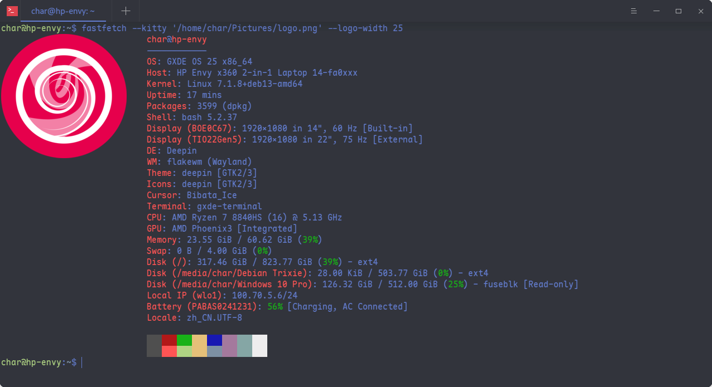

<!-- Improved compatibility of back to top link: See: https://github.com/GXDE-OS/gxde-terminal/pull/73 -->
<a id="readme-top"></a>
<!--
*** Thanks for checking out the Best-README-Template. If you have a suggestion
*** that would make this better, please fork the repo and create a pull request
*** or simply open an issue with the tag "enhancement".
*** Don't forget to give the project a star!
*** Thanks again! Now go create something AMAZING! :D
-->


<!-- PROJECT SHIELDS -->
<!--
*** I'm using markdown "reference style" links for readability.
*** Reference links are enclosed in brackets [ ] instead of parentheses ( ).
*** See the bottom of this document for the declaration of the reference variables
*** for contributors-url, forks-url, etc. This is an optional, concise syntax you may use.
*** https://www.markdownguide.org/basic-syntax/#reference-style-links
-->
[![Contributors][contributors-shield]][contributors-url]
[![Forks][forks-shield]][forks-url]
[![Stargazers][stars-shield]][stars-url]
[![Issues][issues-shield]][issues-url]
[![License][license-shield]][license-url]


<!-- PROJECT LOGO -->
<br />
<div align="center">
  <a href="https://github.com/GXDE-OS/gxde-terminal">
    
  </a>

  <h3 align="center">GXDE终端</h3>

  <p align="center">
    派生自深度终端的又一款终端模拟器
    <br />
    <a href="https://gxde.top"><strong>探索GXDE »</strong></a>
    <br />
    <br />
    <a href="https://github.com/GXDE-OS/gxde-terminal/actions/workflows/launcher-building.yml">查看CI状态</a>
    &middot;
    <a href="https://gitee.com/GXDE-OS/gxde-terminal/issues">报告Bug</a>
    &middot;
    <a href="https://gitee.com/GXDE-OS/gxde-terminal/issues">请求新功能</a>
  </p>
</div>


<!-- ABOUT THE PROJECT -->
## 关于本项目



GXDE终端派生自深度终端，「是一款高级终端仿真器，具有工作区、多窗口、远程管理、震动模式等功能」。

GXDE Terminal现在基于Deepin DTK6构建，但是刻意模仿了`deepin-terminal-gtk`的UI样式与操作逻辑。


### 工具链

- qt6-5compat-dev
- qt6-base-dev
- qt6-tools-dev
- qt6-tools-dev-tools
- qt6-base-private-dev
- libdtk6widget-dev
- libkf6windowsystem-dev
- lxqt-build-tools
- libutf8proc-dev
- libglib2.0-dev
- libsecret-1-dev
- libgtest-dev
- libgmock-dev
- libxcb-ewmh-dev
- libchardet-dev
- libuchardet-dev
- libicu-dev
- zlib1g-dev
- expect
- zssh
- libuchardet0
- libchardet1


<!-- GETTING STARTED -->
## 开始上手
### 手动使用CMake构建安装
#### 前置条件

请确保您安装了所有依赖。您可以使用以下指令安装依赖：

```shell
$ cd gxde-terminal
$ sudo apt build-dep .
```

#### 构建
您需要确保CMake可用，然后便可以执行：
```shell
$ cd gxde-terminal
$ mkdir build
$ cd build
$ cmake ..
$ make
```

#### 安装
```shell
$ sudo make install
```

安装完成后，可在`/usr/bin/gxde-terminal`找到该ELF文件。

### 打包
#### Debian
我们为您提供了一个脚本，用于自动安装依赖项、构建终端程序，并将其打包以便通过`dpkg`/`apt`包管理器进行分发。

```shell
$ chmod a+x ./build-deb  # 确保权限没问题
$ ./build-deb -d         # -d参数用于第一次运行时解析安装依赖，以后单独跑./build-deb就行了
```

构建产物可以在根目录上一级目录找到。

当您想要清理仓库时，可以执行：
```shell
$ ./build-deb -c
```

注意这会给你的构建产物（那些`.deb`包）一并删了。


<!-- USAGE EXAMPLES -->
## 用法
GXDE Terminal跟深度终端相比没什么特别的，除了我们多加了几个功能：
- 字体
  - 现在在设置窗口多了一个回退字体选项，如果你的Monospace字体不支持中文你就可以设置第二个回退字体。
  - 回退字体支持非等宽字体，但是这个选项仅对回退字体开放。对于主字体，他们仍然必须是等宽的。
  - 现在可以启用连笔字了。
- **绘图**: GXDE Terminal现在支持Kitty的图形协议。


<!-- ROADMAP -->
## 里程碑
- [x] 将UI换回DTK2时代的样式。
- [x] 新增UI动画。
- [x] 新增回退字体系统。
- [x] 新增连笔字支持。
- [x] 增加对Kitty图形协议的支持。
- [ ] 打包
    - [x] Debian.
    - [ ] Arch.
    - [ ] Nix.

对于所有的功能请求，您可能希望阅读「[打开的Issues](https://gitee.com/GXDE-OS/gxde-terminal/issues)」。


<!-- CONTRIBUTING -->
## 贡献
### GXDE Terminal的贡献者们:

<a href="https://github.com/GXDE-OS/gxde-terminal/graphs/contributors">
  
</a>


<!-- LICENSE -->
## 许可证
- *GXDE Terminal*以 *[GNU GENERAL PUBLIC LICENSE Version 3](./LICENSE)* 许可授权。
- 您也可能想要读一下 *[Third Party Notices](./THIRD_PARTY_NOTICES.md)*.
- 对于REUSE信息，请参阅 *[dep5](./.reuse/dep5)* 文件。


<!-- CONTACT -->
## 联系我们
如果有任何疑问，请打开一个新Issue


<!-- ACKNOWLEDGMENTS -->
## 鸣谢
- **deepin-terminal**: https://github.com/linuxdeepin/deepin-terminal
- **deepin-terminal-gtk**: https://github.com/martyr-deepin/deepin-terminal-gtk
- **qterminalwidget**: https://github.com/lxqt/qtermwidget
- **kitty**: https://github.com/kovidgoyal/kitty
- **best-readme-template**: https://github.com/othneildrew/Best-README-Template


<!-- MARKDOWN LINKS & IMAGES -->
<!-- https://www.markdownguide.org/basic-syntax/#reference-style-links -->
[contributors-shield]: https://img.shields.io/github/contributors/GXDE-OS/gxde-terminal.svg?style=plastic
[contributors-url]: https://github.com/GXDE-OS/gxde-terminal/graphs/contributors
[forks-shield]: https://img.shields.io/github/forks/GXDE-OS/gxde-terminal.svg?style=plastic
[forks-url]: https://github.com/GXDE-OS/gxde-terminal/network/members
[stars-shield]: https://img.shields.io/github/stars/GXDE-OS/gxde-terminal.svg?style=plastic
[stars-url]: https://github.com/GXDE-OS/gxde-terminal/stargazers
[issues-shield]: https://img.shields.io/github/issues/GXDE-OS/gxde-terminal.svg?style=plastic
[issues-url]: https://github.com/GXDE-OS/gxde-terminal/issues
[license-shield]: https://img.shields.io/github/license/GXDE-OS/gxde-terminal.svg?style=plastic
[license-url]: https://github.com/GXDE-OS/gxde-terminal/blob/dtk6/LICENSE
